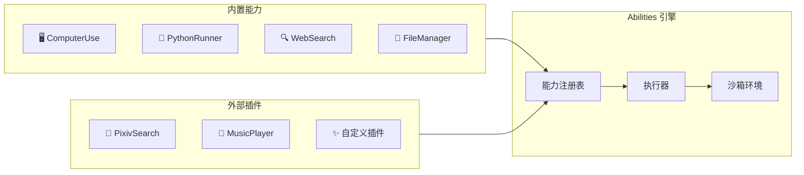

# Abilities 插件规范

## 概述

Abilities 系统提供可扩展的能力框架，分为**内置能力 (Built-in)** 和**外部插件 (Plugins)**。

---

## 架构



---

## 目录结构

```
apps/core/abilities/
├── __init__.py
├── base.py                 # 抽象基类
├── registry.py             # 能力注册表
├── executor.py             # 执行引擎
├── sandbox.py              # 沙箱环境
├── builtin/                # 内置能力
│   ├── __init__.py
│   ├── computer_use.py
│   ├── python_runner.py
│   ├── web_search.py
│   └── file_manager.py
└── plugins/                # 外部插件
    ├── __init__.py
    └── _template/
        ├── manifest.json
        └── plugin.py
```

---

## 核心接口

```python
# apps/core/abilities/base.py

from abc import ABC, abstractmethod
from dataclasses import dataclass
from enum import Enum
from typing import Any

class AbilityType(Enum):
    BUILTIN = "builtin"
    PLUGIN = "plugin"

class AbilityCategory(Enum):
    SYSTEM = "system"       # 系统操作
    MEDIA = "media"         # 媒体处理
    NETWORK = "network"     # 网络请求
    CREATIVE = "creative"   # 创意内容
    UTILITY = "utility"     # 通用工具

@dataclass
class AbilityResult:
    """执行结果"""
    success: bool
    data: Any = None
    error: str | None = None
    emotion_hint: str | None = None  # 角色情感提示

@dataclass
class AbilityContext:
    """执行上下文"""
    user_id: str
    session_id: str
    character_state: dict
    permissions: list[str]

class BaseAbility(ABC):
    """能力抽象基类"""
    
    @property
    @abstractmethod
    def name(self) -> str:
        """唯一标识"""
        pass
    
    @property
    @abstractmethod
    def display_name(self) -> str:
        """显示名称"""
        pass
    
    @property
    @abstractmethod
    def description(self) -> str:
        """描述（供 LLM 理解）"""
        pass
    
    @property
    @abstractmethod
    def ability_type(self) -> AbilityType:
        pass
    
    @property
    @abstractmethod
    def category(self) -> AbilityCategory:
        pass
    
    @property
    @abstractmethod
    def parameters_schema(self) -> dict:
        """参数 JSON Schema"""
        pass
    
    @property
    def required_permissions(self) -> list[str]:
        return []
    
    @abstractmethod
    async def execute(
        self, 
        params: dict, 
        context: AbilityContext
    ) -> AbilityResult:
        pass
    
    async def on_load(self) -> None:
        """加载回调"""
        pass
    
    async def on_unload(self) -> None:
        """卸载回调"""
        pass
```

---

## 插件 Manifest 规范

```json
{
  "$schema": "https://cerise.dev/schemas/plugin-manifest.json",
  "name": "pixiv-search",
  "version": "1.0.0",
  "display_name": "Pixiv 搜索",
  "description": "搜索 Pixiv 插画",
  "author": "Cerise Team",
  "category": "creative",
  "entry_point": "plugin.py",
  "class_name": "PixivSearchPlugin",
  "permissions": ["network.http", "storage.cache"],
  "config_schema": {
    "type": "object",
    "properties": {
      "refresh_token": { "type": "string" }
    },
    "required": ["refresh_token"]
  },
  "dependencies": {
    "pixivpy3": ">=3.7.0"
  }
}
```

---

## 内置能力示例

### PythonRunner

```python
# apps/core/abilities/builtin/python_runner.py

class PythonRunnerAbility(BaseAbility):
    name = "python_runner"
    display_name = "Python 执行器"
    description = "在安全沙箱中执行 Python 代码"
    ability_type = AbilityType.BUILTIN
    category = AbilityCategory.SYSTEM
    
    @property
    def parameters_schema(self) -> dict:
        return {
            "type": "object",
            "properties": {
                "code": {
                    "type": "string",
                    "description": "Python 代码"
                },
                "timeout": {
                    "type": "integer",
                    "default": 30
                }
            },
            "required": ["code"]
        }
    
    required_permissions = ["system.execute"]
    
    async def execute(
        self, 
        params: dict, 
        context: AbilityContext
    ) -> AbilityResult:
        code = params["code"]
        timeout = params.get("timeout", 30)
        
        # 沙箱执行
        result = await self.sandbox.run(code, timeout=timeout)
        
        return AbilityResult(
            success=result.success,
            data={"output": result.stdout},
            error=result.stderr if not result.success else None
        )
```

### ComputerUse

```python
# apps/core/abilities/builtin/computer_use.py

class ComputerUseAbility(BaseAbility):
    name = "computer_use"
    display_name = "电脑控制"
    description = "控制鼠标、键盘和屏幕截图"
    ability_type = AbilityType.BUILTIN
    category = AbilityCategory.SYSTEM
    
    @property
    def parameters_schema(self) -> dict:
        return {
            "type": "object",
            "properties": {
                "action": {
                    "type": "string",
                    "enum": ["screenshot", "click", "type", "scroll"]
                },
                "x": {"type": "integer"},
                "y": {"type": "integer"},
                "text": {"type": "string"}
            },
            "required": ["action"]
        }
    
    required_permissions = ["system.computer_use"]
```

---

## 外部插件示例

### PixivSearch

```python
# apps/core/abilities/plugins/pixiv_search/plugin.py

class PixivSearchPlugin(BaseAbility):
    name = "pixiv_search"
    display_name = "Pixiv 搜索"
    description = "搜索 Pixiv 上的插画作品"
    ability_type = AbilityType.PLUGIN
    category = AbilityCategory.CREATIVE
    
    @property
    def parameters_schema(self) -> dict:
        return {
            "type": "object",
            "properties": {
                "keyword": {"type": "string", "description": "搜索关键词"},
                "count": {"type": "integer", "default": 5, "maximum": 20}
            },
            "required": ["keyword"]
        }
    
    required_permissions = ["network.http"]
    
    async def execute(
        self, 
        params: dict, 
        context: AbilityContext
    ) -> AbilityResult:
        results = await self.client.search_illust(params["keyword"])
        
        return AbilityResult(
            success=True,
            data={"illustrations": results[:params.get("count", 5)]},
            emotion_hint="excited"
        )
```

---

## 权限系统

| 权限 | 说明 |
|------|------|
| `system.execute` | 执行代码 |
| `system.computer_use` | 电脑控制 |
| `system.file_read` | 读取文件 |
| `system.file_write` | 写入文件 |
| `network.http` | HTTP 请求 |
| `storage.cache` | 缓存访问 |

---

## 注册与调用

```python
from apps.core.abilities import AbilityRegistry

# 注册能力
AbilityRegistry.register(PythonRunnerAbility())
AbilityRegistry.load_plugins("apps/core/abilities/plugins")

# 调用能力
result = await AbilityRegistry.execute(
    "python_runner",
    params={"code": "print('Hello, World!')"},
    context=context
)
```
