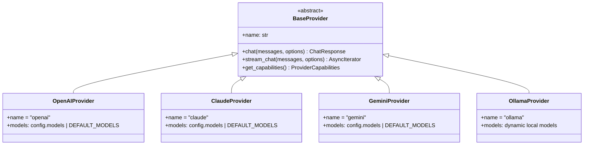

# AI Provider 接口规范

## 概述

Cerise 支持多个 AI 服务提供商，通过统一接口实现无缝切换。

---

## Provider 架构



---

## 基础接口定义

```python
# apps/core/ai/providers/base.py

from abc import ABC, abstractmethod
from dataclasses import dataclass
from typing import AsyncIterator

@dataclass
class Message:
    """对话消息"""
    role: str  # "system" | "user" | "assistant"
    content: str
    name: str | None = None

@dataclass
class ChatOptions:
    """对话选项"""
    model: str
    temperature: float = 0.7
    max_tokens: int = 2048
    top_p: float = 1.0
    stop: list[str] | None = None
    tools: list[dict] | None = None  # Function calling

@dataclass
class ChatResponse:
    """对话响应"""
    content: str
    model: str
    usage: dict[str, int]
    tool_calls: list[dict] | None = None
    finish_reason: str = "stop"

@dataclass
class ProviderCapabilities:
    """Provider 能力描述"""
    streaming: bool = True
    function_calling: bool = False
    vision: bool = False
    max_context_length: int = 4096

class BaseProvider(ABC):
    """AI Provider 抽象基类"""
    
    @property
    @abstractmethod
    def name(self) -> str:
        """Provider 标识"""
        pass
    
    @property
    @abstractmethod
    def available_models(self) -> list[str]:
        """可用模型列表"""
        pass
    
    @abstractmethod
    async def chat(
        self, 
        messages: list[Message], 
        options: ChatOptions
    ) -> ChatResponse:
        """同步对话"""
        pass
    
    @abstractmethod
    async def stream_chat(
        self, 
        messages: list[Message], 
        options: ChatOptions
    ) -> AsyncIterator[str]:
        """流式对话"""
        pass
    
    @abstractmethod
    def get_capabilities(self) -> ProviderCapabilities:
        """获取 Provider 能力"""
        pass
    
    async def health_check(self) -> bool:
        """健康检查"""
        return True
```

---

## Provider 实现示例

### OpenAI Provider

```python
# apps/core/ai/providers/openai_provider.py

from openai import AsyncOpenAI
from .base import BaseProvider, Message, ChatOptions, ChatResponse, ProviderCapabilities

class OpenAIProvider(BaseProvider):
    name = "openai"
    available_models = ["gpt-4o", "gpt-4-turbo", "gpt-4", "gpt-3.5-turbo"]
    
    def __init__(self, api_key: str, base_url: str | None = None):
        self.client = AsyncOpenAI(api_key=api_key, base_url=base_url)
    
    async def chat(
        self, 
        messages: list[Message], 
        options: ChatOptions
    ) -> ChatResponse:
        response = await self.client.chat.completions.create(
            model=options.model,
            messages=[{"role": m.role, "content": m.content} for m in messages],
            temperature=options.temperature,
            max_tokens=options.max_tokens,
            tools=options.tools,
        )
        
        return ChatResponse(
            content=response.choices[0].message.content,
            model=response.model,
            usage={
                "prompt_tokens": response.usage.prompt_tokens,
                "completion_tokens": response.usage.completion_tokens,
            },
            tool_calls=response.choices[0].message.tool_calls,
            finish_reason=response.choices[0].finish_reason,
        )
    
    async def stream_chat(
        self, 
        messages: list[Message], 
        options: ChatOptions
    ) -> AsyncIterator[str]:
        stream = await self.client.chat.completions.create(
            model=options.model,
            messages=[{"role": m.role, "content": m.content} for m in messages],
            temperature=options.temperature,
            max_tokens=options.max_tokens,
            stream=True,
        )
        
        async for chunk in stream:
            if chunk.choices[0].delta.content:
                yield chunk.choices[0].delta.content
    
    def get_capabilities(self) -> ProviderCapabilities:
        return ProviderCapabilities(
            streaming=True,
            function_calling=True,
            vision=True,
            max_context_length=128000,
        )
```

### Claude Provider

```python
# apps/core/ai/providers/claude_provider.py

from anthropic import AsyncAnthropic
from .base import BaseProvider, Message, ChatOptions, ChatResponse, ProviderCapabilities

class ClaudeProvider(BaseProvider):
    name = "claude"
    available_models = ["claude-3-opus-20240229", "claude-3-sonnet-20240229", "claude-3-haiku-20240307"]
    
    def __init__(self, api_key: str):
        self.client = AsyncAnthropic(api_key=api_key)
    
    async def chat(
        self, 
        messages: list[Message], 
        options: ChatOptions
    ) -> ChatResponse:
        # 分离 system message
        system_msg = next((m.content for m in messages if m.role == "system"), None)
        chat_messages = [{"role": m.role, "content": m.content} for m in messages if m.role != "system"]
        
        response = await self.client.messages.create(
            model=options.model,
            max_tokens=options.max_tokens,
            system=system_msg,
            messages=chat_messages,
        )
        
        return ChatResponse(
            content=response.content[0].text,
            model=response.model,
            usage={
                "prompt_tokens": response.usage.input_tokens,
                "completion_tokens": response.usage.output_tokens,
            },
            finish_reason=response.stop_reason,
        )
    
    def get_capabilities(self) -> ProviderCapabilities:
        return ProviderCapabilities(
            streaming=True,
            function_calling=True,
            vision=True,
            max_context_length=200000,
        )
```

---

## Provider 注册表

```python
# apps/core/ai/providers/registry.py

from typing import Type
from .base import BaseProvider

class ProviderRegistry:
    """Provider 注册与管理"""
    
    _providers: dict[str, Type[BaseProvider]] = {}
    _instances: dict[str, BaseProvider] = {}
    
    @classmethod
    def register(cls, provider_class: Type[BaseProvider]) -> None:
        """注册 Provider 类"""
        cls._providers[provider_class.name] = provider_class
    
    @classmethod
    def get(cls, name: str) -> BaseProvider:
        """获取 Provider 实例"""
        if name not in cls._instances:
            if name not in cls._providers:
                raise ValueError(f"Unknown provider: {name}")
            # 从配置加载并实例化
            cls._instances[name] = cls._create_instance(name)
        return cls._instances[name]
    
    @classmethod
    def list_providers(cls) -> list[str]:
        """列出所有注册的 Provider"""
        return list(cls._providers.keys())
```

---

## 配置格式

```yaml
# ~/.cerise/config.yaml

ai:
  default_provider: openai-default
  default_model: gpt-4o
  temperature: 0.7
  max_tokens: 2048
```

`config.yaml` 仅保存全局默认值，Provider 列表与连接信息放在 `providers.yaml`。建议 `ai.default_provider` 与 `providers.yaml` 的 `default` 保持一致（provider id）。

```yaml
# ~/.cerise/providers.yaml

default: openai-default
providers:
  - id: openai-default
    type: openai
    name: OpenAI
    enabled: true
    config:
      api_key: ${OPENAI_API_KEY}
      base_url: null  # 可选，用于代理
      organization: null
      model: gpt-4o  # 可选，连接测试默认模型
      models: ["gpt-4o", "gpt-4o-mini"]  # 可选，覆盖 Provider 的默认模型列表
  
  - id: claude-main
    type: claude
    name: Claude
    enabled: true
    config:
      api_key: ${ANTHROPIC_API_KEY}
      models: ["claude-3-5-sonnet-20241022"]
  
  - id: gemini-main
    type: gemini
    name: Gemini
    enabled: true
    config:
      api_key: ${GOOGLE_API_KEY}
      models: ["gemini-1.5-pro"]
```

---

## 使用示例

```python
from apps.core.ai.providers import ProviderRegistry, Message, ChatOptions

# 获取 Provider
provider = ProviderRegistry.get("openai")

# 对话
messages = [
    Message(role="system", content="你是一个可爱的虚拟主播"),
    Message(role="user", content="你好！"),
]

response = await provider.chat(
    messages,
    ChatOptions(model="gpt-4o", temperature=0.8)
)

print(response.content)

# 流式对话
async for chunk in provider.stream_chat(messages, options):
    print(chunk, end="", flush=True)
```

---

## 管理端点

- `GET /admin/providers` 列出所有配置的 Provider
- `GET /admin/providers?include=models,capabilities` 可选合并模型与能力信息
- `GET /admin/providers/{provider_id}/models` 获取 Provider 的可用模型列表
- `POST /admin/providers/{provider_id}/test` 连接测试
- `POST /admin/providers/{provider_id}/set-default` 设置默认 Provider

---

## 架构分析记录

### 2026-01-11

- 变化目标: 把 Provider 模型列表从代码硬编码解耦到配置，同时补齐模型列表端点。
- 影响范围: Provider 实现、Registry 的连接测试、Admin API。
- 耦合分析: Provider 内部只依赖自身初始化参数，Registry 仅在测试时读取配置并选择模型，API 层只暴露查询接口。
- 风险点: 如果配置未提供 `model` 或 `models` 且 Provider 无默认模型，将导致测试报错并返回明确提示。

### 2026-01-12

- 变化目标: 文档配置示例与实际 `providers.yaml` 对齐，同时提供可选聚合的 Provider 列表返回格式。
- 影响范围: 文档、Admin API 列表接口。
- 耦合分析: 默认返回仍为静态配置，显式 include 才触发运行时 Provider 信息读取。
- 风险点: include 请求可能触发 Provider 实例化，需保证依赖可选且失败时返回空值。
