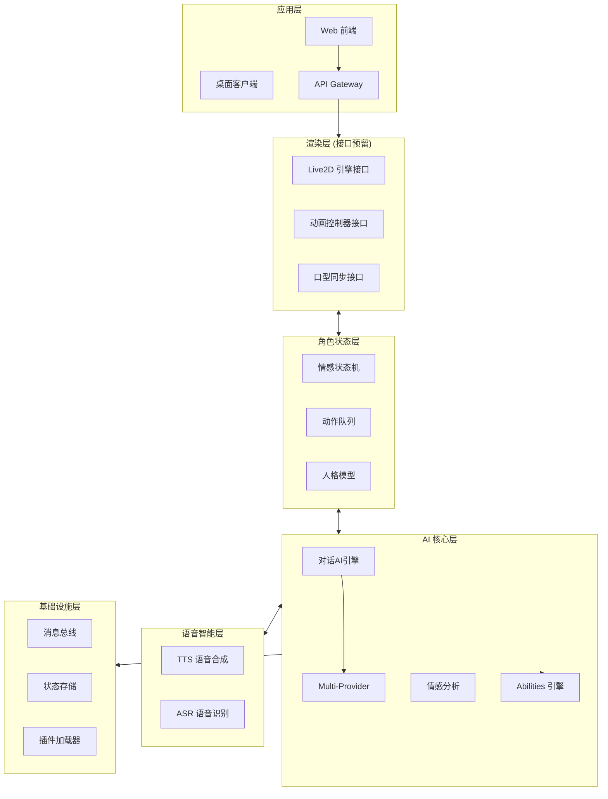
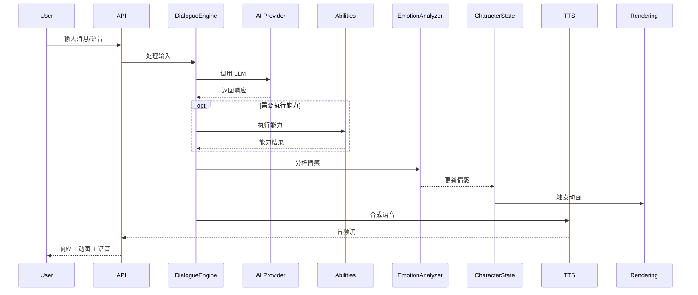

# Cerise 架构设计文档

## 概述

Cerise 是一个 AI 驱动的 Live2D 虚拟形象系统，集成对话AI、情感分析、语音合成/识别和可扩展的能力插件系统。

---

## 系统架构图



---

## 分层设计

### 1. 基础设施层 (Infrastructure)

| 模块 | 职责 | 路径 |
|------|------|------|
| MessageBus | 事件驱动消息传递 | `apps/core/infrastructure/message_bus/` |
| StateStore | 持久化状态管理 | `apps/core/infrastructure/state/` |
| ConfigManager | 统一配置管理 | `apps/core/infrastructure/config/` |
| PluginLoader | 插件发现与加载 | `apps/core/infrastructure/plugins/` |

### 2. 语音智能层 (Voice Intelligence)

复用现有 `apps/tts-server`。

| 模块 | 职责 |
|------|------|
| TTS | GPT-SoVITS 语音合成 |
| ASR | FunASR/Whisper 语音识别 |
| WebSocket | 实时音频流 |

### 3. AI 核心层 (AI Core)

| 模块 | 职责 | 路径 |
|------|------|------|
| DialogueEngine | 多 Provider 对话管理 | `apps/core/ai/dialogue/` |
| ProviderRegistry | AI Provider 统一接口 | `apps/core/ai/providers/` |
| EmotionAnalyzer | 文本情感分析 | `apps/core/ai/emotion/` |
| AbilitiesEngine | 能力执行引擎 | `apps/core/abilities/` |

**支持的 AI Providers:**
- OpenAI (GPT-4, GPT-4o)
- Anthropic Claude
- Google Gemini
- 本地模型 (Ollama)

### 4. 角色状态层 (Character State)

| 模块 | 职责 | 路径 |
|------|------|------|
| EmotionStateMachine | 情感状态转换 | `apps/core/character/emotion/` |
| MotionQueue | 动作序列管理 | `apps/core/character/motion/` |
| PersonalityModel | 人格特征定义 | `apps/core/character/personality/` |

### 5. 渲染层 (Rendering) - 接口预留

> [!NOTE]
> 渲染层仅定义接口规范，具体实现后续完成。

| 接口 | 职责 |
|------|------|
| ILive2DEngine | Live2D 模型加载与渲染 |
| IAnimationController | 动画状态控制 |
| ILipSync | 口型同步控制 |
| IExpressionController | 表情控制 |

### 6. 应用层 (Application)

| 模块 | 职责 | 路径 |
|------|------|------|
| API Gateway | REST/WebSocket 入口 | `apps/core/api/` |
| Web Frontend | 前端应用 | `apps/web/` |

---

## 数据流



---

## 目录结构

```
apps/
├── core/                           # 核心模块 (Python)
│   ├── infrastructure/             # 基础设施
│   │   ├── message_bus/
│   │   ├── state/
│   │   ├── config/
│   │   └── plugins/
│   ├── ai/                         # AI 核心
│   │   ├── dialogue/
│   │   ├── providers/              # 多 Provider 统一接口
│   │   │   ├── base.py
│   │   │   ├── openai_provider.py
│   │   │   ├── claude_provider.py
│   │   │   └── gemini_provider.py
│   │   └── emotion/
│   ├── character/                  # 角色状态
│   │   ├── emotion/
│   │   ├── motion/
│   │   └── personality/
│   ├── abilities/                  # 能力系统
│   │   ├── base.py
│   │   ├── registry.py
│   │   ├── builtin/
│   │   └── plugins/
│   └── api/                        # API 网关
├── tts-server/                     # 语音服务 (已存在)
└── web/                            # 前端 (TypeScript)
    └── src/
        └── rendering/              # 渲染接口定义
```

---

## 相关文档

- [Abilities 插件规范](./abilities-spec.md)
- [AI Provider 接口规范](./ai-providers.md)
